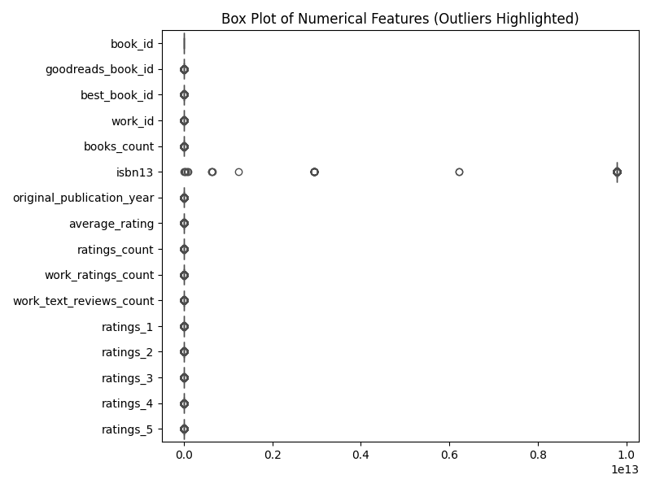

# Goodreads Data Analysis
### Dataset Overview

The dataset consists of 10,000 entries, each representing a unique book with 23 attributes. These attributes include identifiers like `book_id`, `goodreads_book_id`, `best_book_id`, and `work_id`, as well as metadata such as `authors`, `original_publication_year`, `average_rating`, and various rating distributions. The dataset also contains information about the number of books associated with a particular entry (`books_count`), the ISBN numbers, and URLs for book images.

### Description of the Analysis Performed

#### Summary Statistics
The analysis began with a thorough examination of summary statistics for each attribute. Key findings include:

- **Rating Metrics**: The average rating across the dataset is approximately 4.00, indicating a generally positive reception among readers. The ratings are distributed with a standard deviation of 0.25, suggesting that while most books are rated well, there are some outliers.
- **Publication Year**: The average original publication year is around 1982, with a significant range from as early as 1750 to 2017, highlighting the dataset's inclusion of both classic and contemporary works.
- **Authors**: There are 4,664 unique authors, with Stephen King being the most frequently represented, appearing 60 times.
- **Missing Data**: Notably, there are missing values in several columns, including `isbn` (700 missing), `isbn13` (585 missing), and `original_title` (585 missing). Additionally, the `language_code` field has 1,084 missing entries, indicating a need for data cleaning or imputation.

#### Correlation Matrix
A correlation matrix was generated to identify relationships between numerical attributes. Key observations include:

- **Ratings Correlation**: There is a strong positive correlation between `ratings_count`, `work_ratings_count`, and the individual ratings (1 to 5). For instance, `ratings_count` has a correlation of approximately 0.995 with `work_ratings_count`, suggesting that books with more ratings tend to have more overall work ratings. 
- **Average Rating**: The average rating shows weak correlations with other metrics, indicating that the number of ratings a book receives may not directly influence its average rating significantly.
- **Books Count Impact**: The `books_count` negatively correlates with `average_rating`, suggesting that books by authors with a larger number of works may receive lower ratings on average.

#### Outlier Detection
Using an outlier detection analysis, specific entries were flagged as potential outliers. For example, several books were identified with unusually high values in `average_rating` (72), suggesting these ratings may be erroneous or represent books that are niche or specialized. Similarly, anomalies were observed in the `ratings_count` and other related metrics, highlighting data quality issues that may require further investigation.

### Insights Derived from the Data

1. **General Reception**: The overall positive average rating indicates that the dataset contains well-received books, potentially appealing to readers looking for quality literature.
2. **Author Representation**: The prevalence of certain authors, like Stephen King, suggests a popularity bias, which might skew average ratings for books within this category.
3. **Publication Trends**: The range of publication years indicates that the dataset captures a broad spectrum of literature, which could help in analyzing trends over time in reader preferences or rating changes.
4. **Data Quality Issues**: The presence of missing data and outliers suggests that further data cleaning is necessary to ensure the reliability of insights derived from the dataset.

### Recommendations

1. **Data Cleaning**: Address missing values through imputation or exclusion based on the context of the analysis. Outliers should be investigated further to determine if they represent genuine data points or errors.
2. **Further Analysis**: Conduct a deeper analysis of how the number of ratings affects average ratings across different genres or author backgrounds. This could unveil insights into reader behavior and preferences.
3. **Focus on Niche Books**: Explore the relationship between niche or specialized books and their reception, particularly those with high ratings but low counts, to identify potential hidden gems in the dataset.
4. **Diversity in Recommendations**: When recommending books, consider the diversity of authors and publication years to provide a broader selection that appeals to varied reader interests.
5. **User Engagement Strategies**: Utilize the dataset to develop strategies aimed at increasing user engagement, such as targeted promotions for lesser-known authors based on their high-quality ratings.

In conclusion, this dataset presents a wealth of information about reader preferences and book characteristics. By leveraging these insights and addressing the identified data quality issues, stakeholders can enhance their understanding of the literary landscape and improve decision-making processes in publishing, marketing, and recommendation systems.
## Visualizations

    
